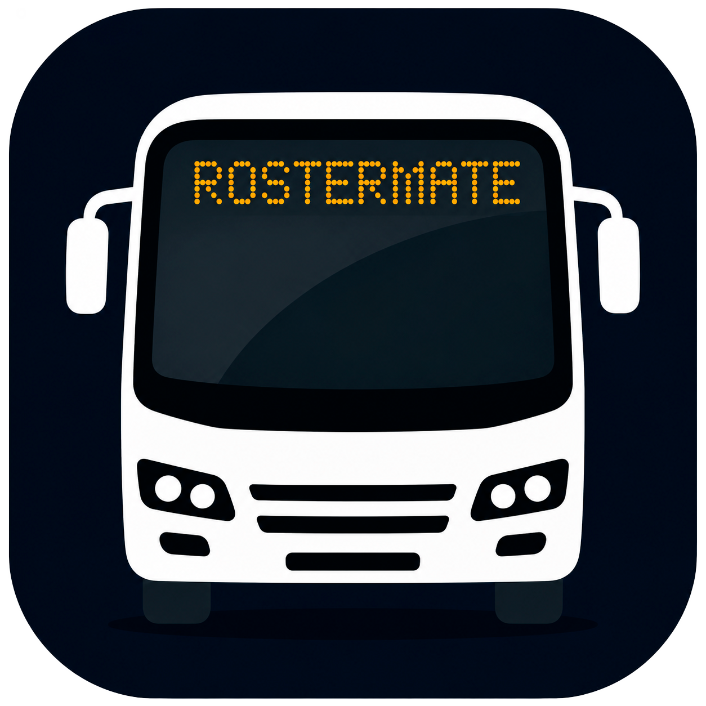
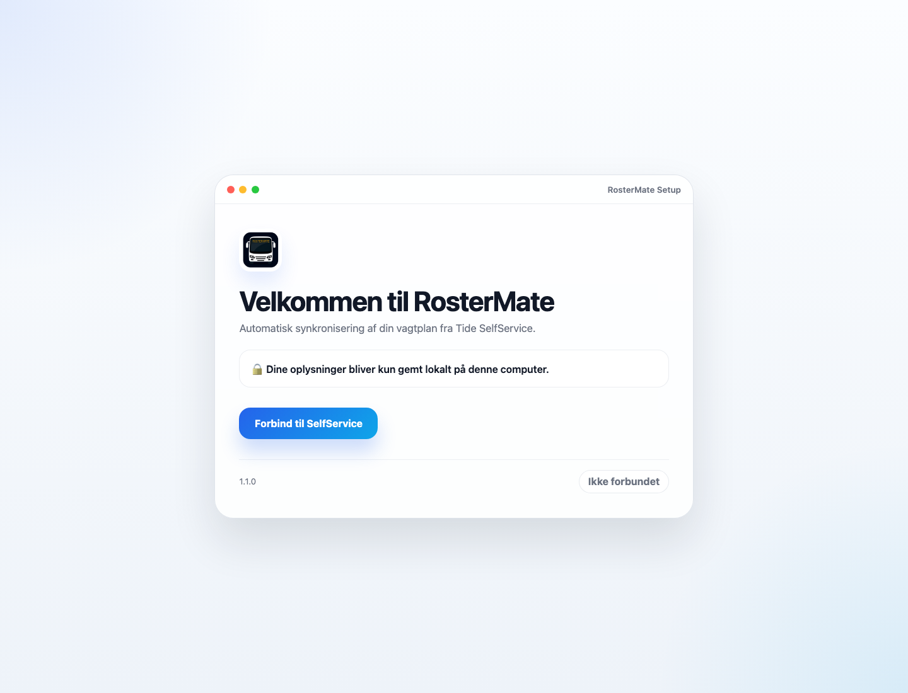
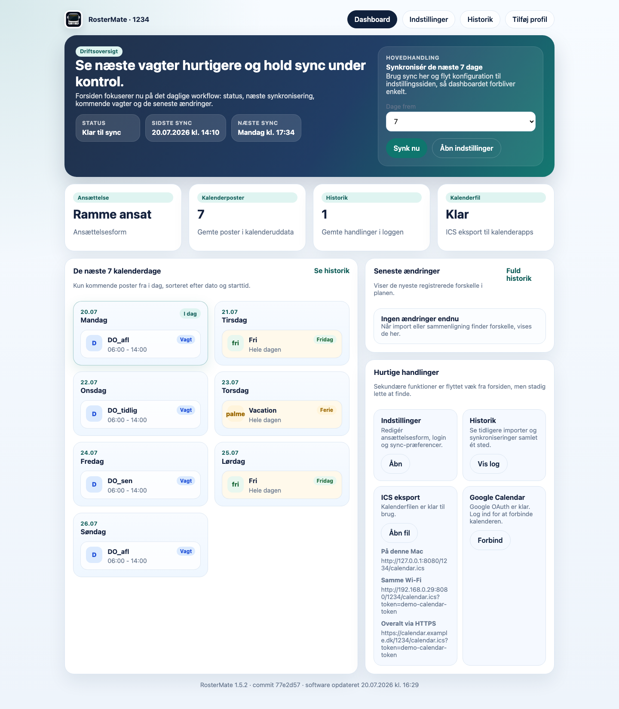
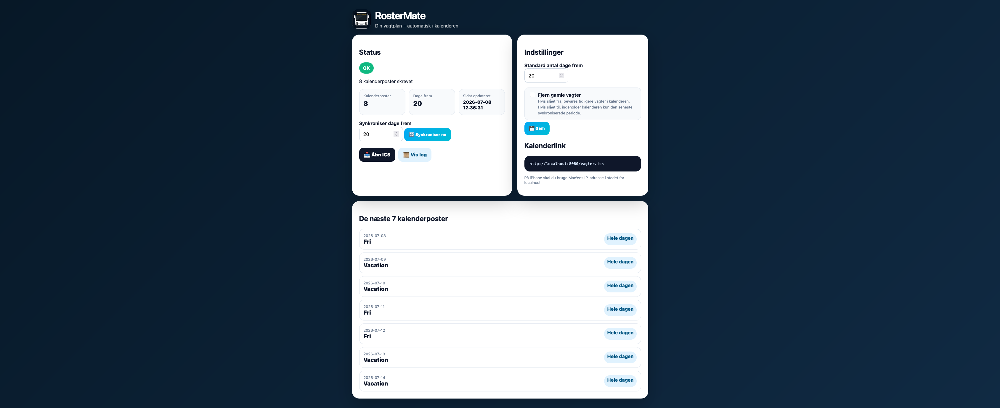
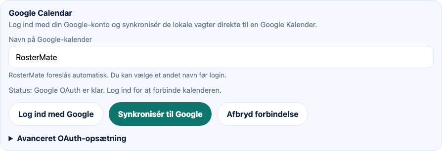

  

<h1 align="center">RosterMate</h1>

  Din vagtplan fra SelfService – automatisk samlet, opdateret og klar i kalenderen.

  
  
  
  

## Mere overblik – mindre manuelt arbejde

RosterMate er skabt til buschauffører, der vil have deres vagter ud af SelfService og ind i en overskuelig kalender. Appen kører lokalt på din computer, holder styr på ændringer og samler de vigtigste oplysninger på ét enkelt dashboard.

Du slipper for at kopiere vagter manuelt, bladre frem og tilbage mellem måneder og kontrollere kalenderen igen og igen. RosterMate henter planen, gemmer historikken og opdaterer kalenderfilen for dig.

## Det kan RosterMate

- Hente vagter direkte fra SelfService
- Synkronisere på tværs af månedsskift
- Vise de næste syv forskellige kalenderdage på dashboardet
- Eksportere vagter til Apple Kalender og andre ICS-kompatible kalendere
- Dele kalenderen lokalt, på samme Wi-Fi eller via en valgfri offentlig HTTPS-adresse
- Logge ind med Google og automatisk oprette eller genbruge en separat kalender med valgfrit navn
- Registrere ændringer og gemme historik
- Holde flere chaufførprofiler adskilt
- Opdatere softwaren automatisk fra den stabile GitHub-version
- Opbevare SelfService-session og kalenderdata lokalt
- Køre den samme GUI og synkroniseringsmotor på macOS og Windows

## Sådan virker det

1. Åbn opsætningsguiden og forbind til SelfService.
2. Vælg hvor langt frem RosterMate skal hente vagter.
3. RosterMate synkroniserer planen og opdaterer dashboard, historik og kalenderfil.
4. Abonnér på kalenderen fra din Mac, iPhone eller en anden kalenderapp.

## Screenshots

### Opsætningsguide

### Dashboard

### Vagtoversigt

### Google Calendar

## Roadmap

### Tilgængeligt nu

- [x] Guidet SelfService-login
- [x] Automatisk genlogin og synkronisering
- [x] Synkronisering på tværs af kalendermåneder
- [x] Dashboard med kommende vagter
- [x] ICS-eksport til kalenderapps
- [x] Lokal, netværksbaseret og tokenbeskyttet kalenderdeling
- [x] Historik, ændringsregistrering og backup
- [x] Separate chaufførprofiler
- [x] Automatiske softwareopdateringer
- [x] Windows-beta med installation, start og autostart
- [x] Google-login med automatisk oprettelse og navngivning af en separat kalender

### Næste versioner

- [ ] Menu-bar-app til macOS
- [ ] Notifikationer ved ændrede vagter
- [ ] Forbedret release- og backupflow
- [ ] Signeret macOS-installationspakke
- [ ] Signeret Windows-installationspakke

### På længere sigt

- [ ] Native menu-/bakkeapp til både macOS og Windows
- [ ] Mere fleksibel kalenderdeling uden krav om en tændt hjemmecomputer
- [ ] Flere SelfService-varianter og arbejdspladser
- [ ] Mobilvenlig status- og opsætningsside

## Installation

- [Download RosterMate til macOS](https://github.com/Danish-Busdriver/rostermate/releases/latest/download/RosterMate-1.3.0-macOS.zip)
- [Download RosterMate til Windows (beta)](https://github.com/Danish-Busdriver/rostermate/releases/latest/download/RosterMate-1.3.0-Windows.zip)

Har du brug for hjælp, finder du de separate vejledninger til [macOS](docs/INSTALL_MACOS.md) og [Windows](docs/INSTALL_WINDOWS.md).

## Projektet

RosterMate er et open source-projekt under MIT-licensen. Projektet er udviklet af Daniel Pullen – buschauffør, disponent og software-entusiast.

[GitHub-profil](https://github.com/Danish-Busdriver) · [Licens](LICENSE)
