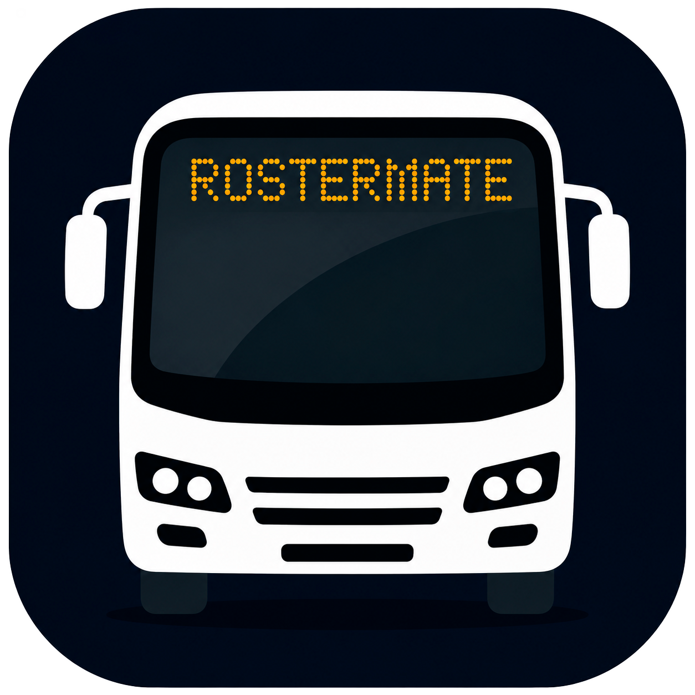
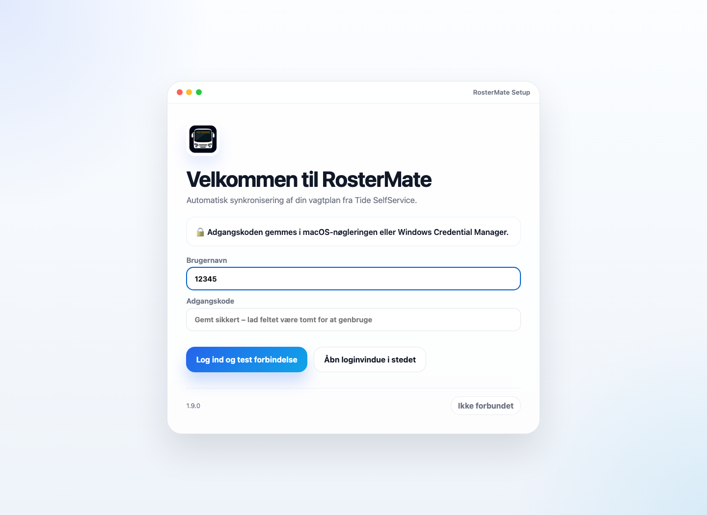
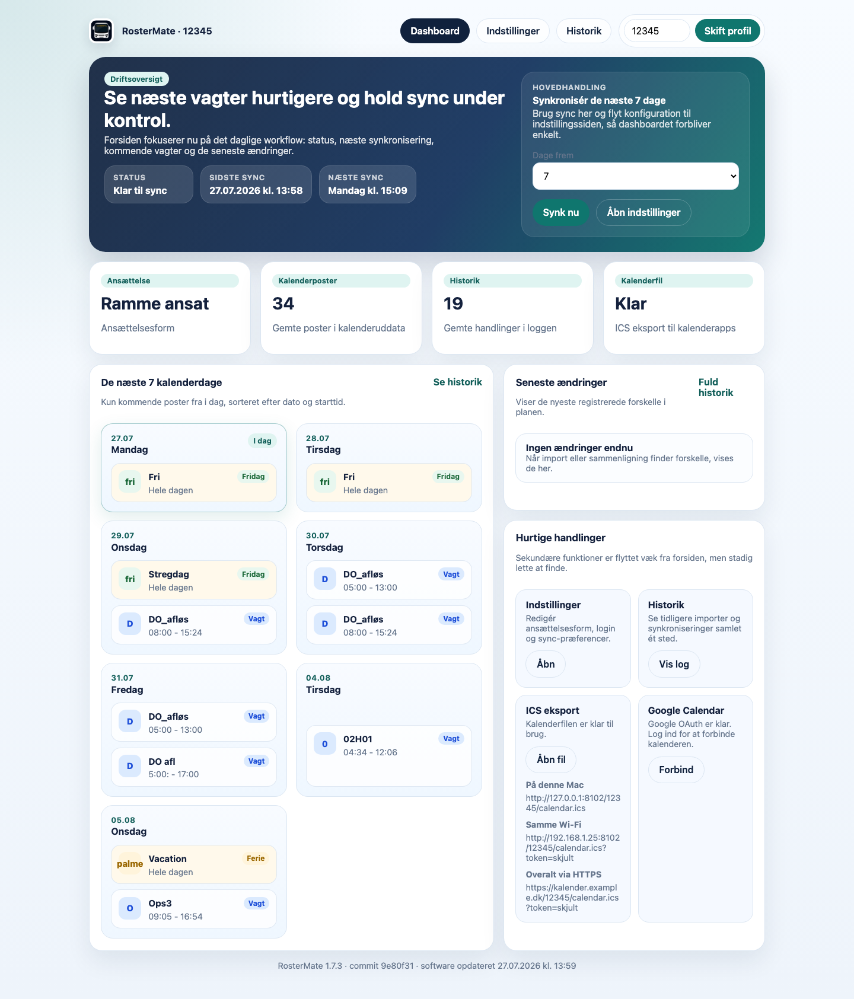
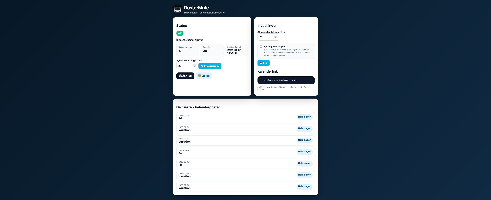
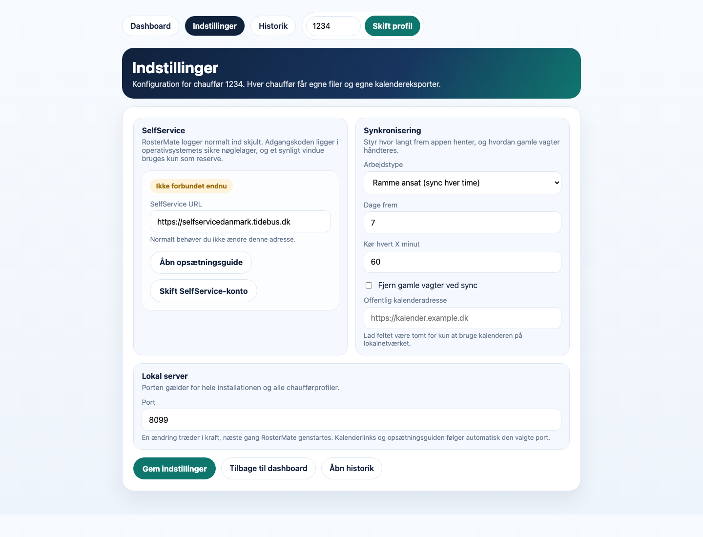

  

<h1 align="center">RosterMate</h1>

  Din vagtplan fra SelfService – automatisk samlet, opdateret og klar i kalenderen.

  
  
  
  

## Din vagtplan uden det manuelle arbejde

RosterMate er lavet til buschauffører, der vil have vagterne ud af SelfService og ind i deres egen kalender. Appen kører lokalt på din Mac eller Windows-pc og samler synkronisering, kommende vagter, historik og kalenderdeling i ét enkelt dashboard.

Vælg selv, hvor mange dage der skal hentes. RosterMate følger perioden på tværs af månedsskift, opdaterer ændrede vagter og bevarer den seneste gyldige kalender, hvis SelfService midlertidigt fejler.

## Det får du

- Automatisk hentning af vagter fra Tide SelfService
- Belastningsspredt automatisk sync på et fast, tilfældigt tidspunkt for hver profil
- Skjult genlogin med adgangskoden sikkert gemt i macOS-nøgleringen eller Windows Credential Manager
- Synligt loginvindue som reserve, hvis SelfService kræver ny godkendelse
- Synkronisering på tværs af kalendermåneder
- Dashboard med status, kommende vagter og seneste ændringer
- Valgfri synkroniseringsperiode, som huskes efter genstart
- ICS-kalender til Apple Kalender, iPhone og andre kalenderapps
- Kalenderlink til samme computer, lokalt netværk eller en valgfri HTTPS-adresse
- Historik, ændringsregistrering og automatisk backup
- Separate profiler til flere chauffører
- Daglig versionskontrol med downloadknap ved nye udgivelser
- RosterMate-logo i Mac-menulinjen og Windows-systembakken
- Automatisk valg af en ledig lokal port

Login- og kalenderdata bliver på din egen computer. En tom eller afbrudt hentning kan ikke overskrive den seneste fungerende kalender.

## Sådan virker det

1. Opret din chaufførprofil i opsætningsguiden.
2. Forbind RosterMate til SelfService.
3. Vælg hvor mange dage frem der skal synkroniseres.
4. Tilføj RosterMates kalenderlink i din foretrukne kalenderapp.

Herefter kan du altid synkronisere manuelt fra dashboardet. Automatisk sync fordeles, så rammeansatte synkroniserer én gang dagligt mellem kl. 12 og 14, mens fast turnus synkroniserer tirsdag og torsdag mellem kl. 9 og 16. Hver profil får egne faste, tilfældigt valgte tider inden for vinduerne. RosterMate forsøger først automatisk login og viser kun loginvinduet, hvis SelfService ikke længere accepterer de gemte oplysninger.

## Se RosterMate

### Opsætningsguide

### Dashboard

### Vagtoversigt

### Indstillinger

## Roadmap

### Tilgængeligt nu

- [x] macOS- og Windows-app med samme GUI
- [x] Guidet og automatisk SelfService-login
- [x] Tilfældige automatiske sync-tider, der fordeler belastningen
- [x] Synkronisering på tværs af måneder
- [x] Dashboard, historik og ændringsregistrering
- [x] ICS-eksport og kalenderdeling
- [x] Flere chaufførprofiler
- [x] Mac-menulinjeikon og Windows-systembakke
- [x] Daglig versionskontrol
- [x] Direkte macOS PKG og Windows Setup.exe
- [x] Afinstallation på begge platforme

### Næste versioner

- [ ] Notifikationer ved ændrede vagter
- [ ] Bedre backup- og gendannelsesflow
- [ ] Signeret og notariseret macOS-installationspakke
- [ ] Digitalt signeret Windows-installationspakke

### På længere sigt

- [ ] Kalenderdeling uden krav om en tændt hjemmecomputer
- [ ] Flere SelfService-varianter og arbejdspladser
- [ ] Mobilvenlig status- og opsætningsside

## Hent RosterMate

- [RosterMate 1.11.0 til macOS](https://github.com/Danish-Busdriver/rostermate/releases/latest/download/RosterMate-1.11.0-macOS.pkg)
- [RosterMate 1.11.0 til Windows](https://github.com/Danish-Busdriver/rostermate/releases/latest/download/RosterMate-1.11.0-Windows-Setup.exe)

Teknisk installation, fejlfinding og afinstallation findes i de separate vejledninger:

- [Installation på macOS](docs/INSTALL_MACOS.md)
- [Installation på Windows](docs/INSTALL_WINDOWS.md)

## Projektet

RosterMate er open source under MIT-licensen og udvikles af Daniel Pullen – buschauffør, disponent og software-entusiast.

[GitHub-profil](https://github.com/Danish-Busdriver) · [Licens](LICENSE)
